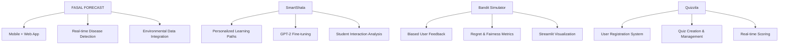

# Hello, I'm Saundarya Subramaniam

<div align="center">
  
[](https://git.io/typing-svg)

</div>

---

## About Me


**3rd Year Computer Engineering Student** at K.J. Somaiya College of Engineering  
**Current CGPA:** 9.5/10 | **Honors CGPA:** 10/10  
**Research Focus:** Legal Document Analysis using LLMs & VLMs  
**Passion:** Making AI accessible and human-centered  

### Beyond Code
- **National Scholarship Recipient** from Ministry of Culture for Violin
- **Music Therapist** - Volunteer at old age homes and AnamPrem
- **Spotify Campus Ambassador** - Bridging music and student engagement

---

## Current Journey

```python
class SaundaryaSubramaniam:
    def __init__(self):
        self.role = "AI/ML Research Associate"
        self.location = "Mumbai, India"
        self.current_focus = ["Vision-Language Models", "Reinforcement Learning", "Legal AI"]
        self.research_areas = ["Human-in-the-Loop AI", "Preference Learning", "Accessibility AI"]
        
    def get_current_work(self):
        return {
            "research": "Legal document analysis using LLMs/VLMs",
            "internship": "Building Xelly - Excel trade analysis tool",
            "learning": "Multi-Agent AI Systems & RL Applications"
        }
        
    def collaborate_on(self):
        return ["Open Source ML Projects", "AI Research", "Hackathons", "Accessibility Tech"]
```

---

## Professional Experience

<details>
<summary><strong>AGR Knowledge Services Pvt Ltd</strong> - AI/ML Intern (May 2025 – July 2025)</summary>

### Key Achievement: **Xelly** - Excel Analysis Powerhouse
- **30,000+ rows processed** per run with intelligent clustering
- **50% faster preprocessing** through optimized algorithms
- **Tech Stack:** Python (Flask, FastAPI), React, Redis, Prophet, Scikit-learn
- Interactive insights with Plotly visualizations

</details>

<details>
<summary><strong>Somaiya ML Research Association</strong> - Research Associate (Aug 2024 – June 2025)</summary>

### Mission: Democratizing Legal Knowledge
- Researching **Legal Document Analysis** using cutting-edge LLMs & VLMs
- Conducted workshops for **100+ students** on core ML concepts
- Focus on improving **public access to legal information**

</details>

<details>
<summary><strong>Software Development Center</strong> - Data Science Intern (May 2024 – July 2024)</summary>

### Hindi Poetry Generation Project
- Scraped & preprocessed **1000+ Hindi poetry samples**
- Trained **LSTM models** to mimic original poets' styles
- Text normalization, tokenization, and formatting for generative AI

</details>

<details>
<summary><strong>Orion Racing India</strong> - BMS & ECU Developer (Sept 2023 – May 2024)</summary>

### Battery Management & Electronic Control Systems
- Developed **ECU logic** for motor torque and APP signals
- Implemented **battery stack monitoring** systems
- Focus on automotive electronics and control systems

</details>

---

## Tech Arsenal

<div align="center">

### AI/ML & Data Science


### Full Stack Development


### Languages


### Databases & Cloud


### Tools & Frameworks


</div>

---

## Featured Projects

<div align="center">

| **FASAL FORECAST** | **SmartShala** | **Preference Bandits** | **Quizzila** |
|:---:|:---:|:---:|:---:|
| Crop Disease Detection | Learning Roadmap Engine | Biased Feedback Simulator | Interactive Quiz Platform |
| Flutter + TensorFlow | GPT-2 + Reinforcement Learning | E-Greedy + Thompson Sampling | PHP + MySQL + Bootstrap |
| InceptionV3 Transfer Learning | Real-time Adaptation | Fairness Metrics Analysis | Full-Stack Web Application |

</div>

### Project Highlights



### Technical Deep Dive

**FASAL FORECAST** - Crop Disease Prediction and Management System
- Built comprehensive mobile and web application using Flutter and Flask
- Implemented TensorFlow-based disease detection with InceptionV3 transfer learning
- Integrated environmental data analysis for treatment recommendations
- Real-time image processing and classification with 95%+ accuracy

**SmartShala** - Personalized Learning Roadmap Engine
- Developed adaptive learning system using GPT-2 fine-tuning
- Implemented reinforcement learning for dynamic path optimization
- Real-time preference tracking based on student interactions
- Intelligent content recommendation system

**Preference-Based Bandit Simulator**
- Simulated biased human feedback in multi-armed bandit scenarios
- Implemented E-Greedy and Thompson Sampling algorithms
- Comprehensive analysis of regret minimization and fairness metrics
- Interactive visualizations using Streamlit and Matplotlib

---

## GitHub Analytics

<div align="center">
  


</div>

<div align="center">
  


</div>

---

## Achievements & Recognition

<div align="center">

### Competitive Programming
[](https://www.hackerrank.com/saundarya_s1)
[](https://leetcode.com/saun09)

**Gold Badges:** Python & C Programming on HackerRank  
**Streak Master:** 50-Day LeetCode Streak + May Daily Challenge  
**Problem Solver:** 100+ LeetCode Problems Solved

### Certifications
- **Reinforcement Learning** - NPTEL (July - October 2024)
- **Introduction to Multi-Agent AI Systems** - IUCEE (December 2024 - January 2025)

### Cultural Excellence
- **National Scholarship** - Ministry of Culture for Violin Performance
- **Classical Music Examinations** - Successfully passed 4 levels
- **Music Therapy Volunteer** - Regular performances at old age homes & AnamPrem

</div>

---

## Research & Publications

### Published Research
**"Comparative Analysis of Deep Learning Models for Crop Disease Detection"**  
*Authors: Saundarya Subramaniam, Shalini Majumdar, Shantanu Nadar, Kaustubh Kulkarni*

**Key Contributions:**
- Comprehensive evaluation of **5 deep learning models** on dataset of **130,000+ crop images**
- Achieved **95.76% classification accuracy** with custom CNN architecture
- Demonstrated effectiveness of **transfer learning** techniques for agricultural applications
- Provided benchmark comparisons for future crop disease detection research

### Current Research Focus
- **Legal Document Analysis** using Large Language Models and Vision-Language Models
- **Human-in-the-Loop AI Systems** for improved decision making
- **Preference Learning** and bias mitigation in AI systems
- **Accessibility-focused AI applications** for underserved communities

---

## Connect With Me

<div align="center">

[](mailto:saundaryasubramaniam@gmail.com)
[](http://linkedin.com/in/saundarya-subramaniam-a43a2b27a)
[](https://github.com/saun09)

**Email:** saundaryasubramaniam@gmail.com  
**LinkedIn:** [Saundarya Subramaniam](http://linkedin.com/in/saundarya-subramaniam-a43a2b27a)

</div>

---

<div align="center">

### *"Building intelligent systems that understand, adapt, and serve humanity"*


**Star my repositories if you find them interesting!**

</div>

---

<div align="center">
  
```ascii
╔═══════════════════════════════════════════════════╗
║  AI Enthusiast | Musician | Researcher            ║
║  Open Source Contributor | Future Builder         ║
║  Making AI Accessible for Everyone                ║
╚═══════════════════════════════════════════════════╝
```

</div>

---

## Current Learning & Development

**Vision-Language Models:** Exploring multimodal AI systems for document understanding  
**Reinforcement Learning:** Advanced applications in human-computer interaction  
**Legal Tech:** Developing AI solutions for legal document analysis and accessibility  
**Multi-Agent Systems:** Collaborative AI frameworks for complex problem solving

**Open to Collaboration:** AI Research Projects, Open Source Contributions, Hackathons, and Accessibility Technology Development
